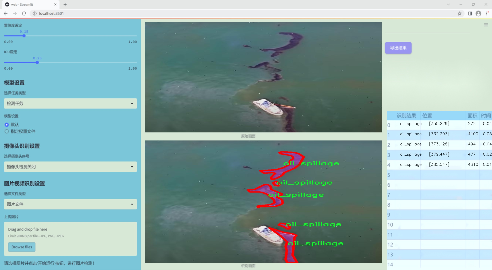
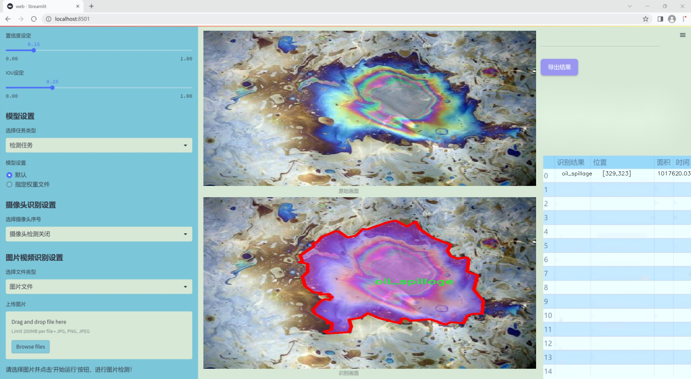
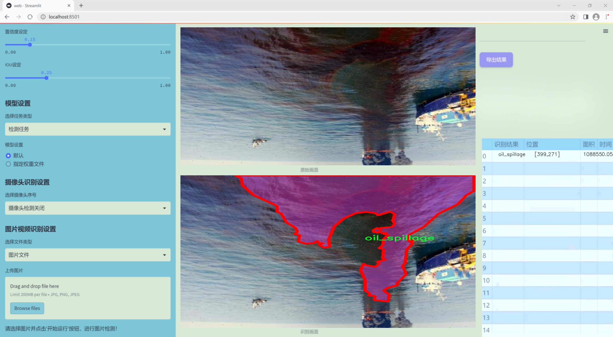
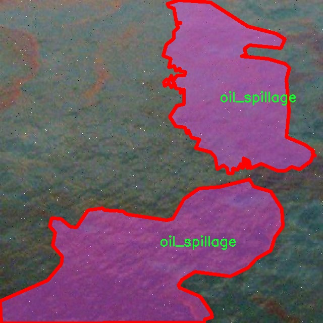
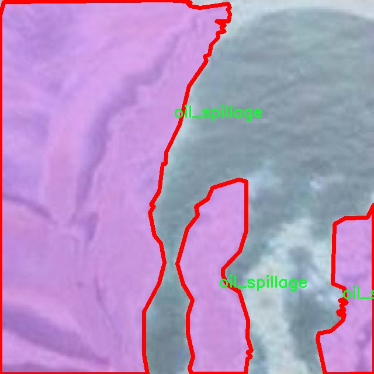
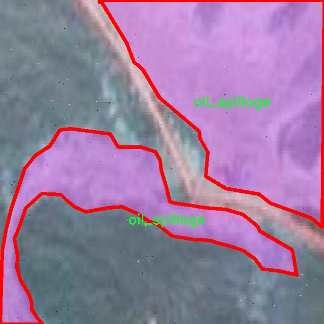
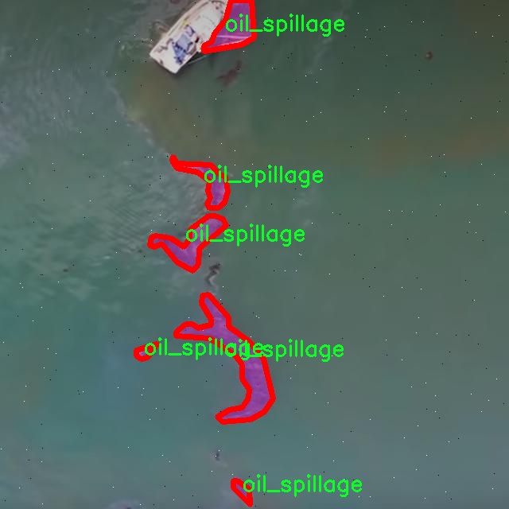

### 1.背景意义

研究背景与意义

海洋环境的保护已成为全球关注的热点问题之一，尤其是在石油开采和运输活动频繁的地区，油污泄漏事件的发生频率逐年上升。油污泄漏不仅对海洋生态系统造成严重威胁，还对沿海经济和人类健康产生深远影响。因此，开发高效、准确的油污泄漏检测系统显得尤为重要。传统的油污检测方法往往依赖人工监测和现场勘查，效率低下且易受人为因素影响，难以实现实时监控和快速响应。

近年来，随着计算机视觉技术的迅猛发展，基于深度学习的目标检测算法逐渐成为油污检测领域的研究热点。YOLO（You Only Look Once）系列算法因其高效的实时检测能力和良好的检测精度，成为海上油污泄漏监测的理想选择。特别是YOLOv11的改进版本，进一步提升了模型的检测性能和适应性，使其在复杂海洋环境中能够更准确地识别油污泄漏现象。

本研究旨在基于改进的YOLOv11算法，构建一个高效的海上油污泄漏检测系统。我们将利用一个包含762张图像的专用数据集，该数据集专注于油污泄漏的检测，类别数量为1，确保了模型的专一性和针对性。通过对数据集的深入分析和模型的优化训练，我们期望实现对油污泄漏的高效检测，进而为海洋环境保护提供技术支持。

综上所述，本研究不仅具有重要的学术价值，也为实际应用提供了切实可行的解决方案。通过引入先进的计算机视觉技术，我们希望能够显著提高海洋油污泄漏的检测效率，为海洋生态环境的保护贡献一份力量。

### 2.视频效果

[2.1 视频效果](https://www.bilibili.com/video/BV1gWU6Y8E18/)

### 3.图片效果







##### [项目涉及的源码数据来源链接](https://kdocs.cn/l/cszuIiCKVNis)**

注意：本项目提供训练的数据集和训练教程,由于版本持续更新,暂不提供权重文件（best.pt）,请按照6.训练教程进行训练后实现上图演示的效果。

### 4.数据集信息

##### 4.1 本项目数据集类别数＆类别名

nc: 1
names: ['oil_spillage']


该项目为【图像分割】数据集，请在【训练教程和Web端加载模型教程（第三步）】这一步的时候按照【图像分割】部分的教程来训练

##### 4.2 本项目数据集信息介绍

本项目数据集信息介绍

本项目所使用的数据集专注于海上油污泄漏的检测，旨在为改进YOLOv11模型提供高质量的训练数据。数据集的主题围绕“油污泄漏”（oil spillage），其重要性在于海洋环境保护和生态系统的可持续发展。随着全球石油开采和运输活动的增加，油污泄漏事件频繁发生，给海洋生物和生态环境带来了严重威胁。因此，开发一个高效的检测系统显得尤为重要。

该数据集包含了丰富的图像数据，专门标注了油污泄漏的相关特征。数据集中仅包含一个类别，即“油污泄漏”（oil_spillage），这使得模型在训练过程中能够集中学习与油污泄漏相关的特征，从而提高检测的准确性和效率。尽管类别数量较少，但数据集中的图像涵盖了多种不同的场景和条件，包括不同的天气、光照以及海洋环境，这些多样性确保了模型的泛化能力。

为了增强模型的鲁棒性，数据集中的图像来源于多个海域和不同的时间段，确保了样本的多样性和代表性。此外，数据集还包含了不同规模和形态的油污泄漏实例，这将有助于模型学习到更为细致的特征，从而在实际应用中能够更准确地识别和定位油污泄漏事件。

总之，本项目的数据集不仅为YOLOv11模型的训练提供了必要的基础数据，还通过精心设计的标注和多样化的样本，确保了模型在海上油污泄漏检测任务中的有效性和可靠性。通过对这一数据集的深入分析和应用，我们期望能够显著提升油污泄漏的检测能力，为海洋环境保护贡献一份力量。










### 5.全套项目环境部署视频教程（零基础手把手教学）

[5.1 所需软件PyCharm和Anaconda安装教程（第一步）](https://www.bilibili.com/video/BV1BoC1YCEKi/?spm_id_from=333.999.0.0&vd_source=bc9aec86d164b67a7004b996143742dc)


[5.2 安装Python虚拟环境创建和依赖库安装视频教程（第二步）](https://www.bilibili.com/video/BV1ZoC1YCEBw?spm_id_from=333.788.videopod.sections&vd_source=bc9aec86d164b67a7004b996143742dc)

### 6.改进YOLOv11训练教程和Web_UI前端加载模型教程（零基础手把手教学）

[6.1 改进YOLOv11训练教程和Web_UI前端加载模型教程（第三步）](https://www.bilibili.com/video/BV1BoC1YCEhR?spm_id_from=333.788.videopod.sections&vd_source=bc9aec86d164b67a7004b996143742dc)


按照上面的训练视频教程链接加载项目提供的数据集，运行train.py即可开始训练



     Epoch   gpu_mem       box       obj       cls    labels  img_size
     1/200     20.8G   0.01576   0.01955  0.007536        22      1280: 100%|██████████| 849/849 [14:42<00:00,  1.04s/it]
               Class     Images     Labels          P          R     mAP@.5 mAP@.5:.95: 100%|██████████| 213/213 [01:14<00:00,  2.87it/s]
                 all       3395      17314      0.994      0.957      0.0957      0.0843

     Epoch   gpu_mem       box       obj       cls    labels  img_size
     2/200     20.8G   0.01578   0.01923  0.007006        22      1280: 100%|██████████| 849/849 [14:44<00:00,  1.04s/it]
               Class     Images     Labels          P          R     mAP@.5 mAP@.5:.95: 100%|██████████| 213/213 [01:12<00:00,  2.95it/s]
                 all       3395      17314      0.996      0.956      0.0957      0.0845

     Epoch   gpu_mem       box       obj       cls    labels  img_size
     3/200     20.8G   0.01561    0.0191  0.006895        27      1280: 100%|██████████| 849/849 [10:56<00:00,  1.29it/s]
               Class     Images     Labels          P          R     mAP@.5 mAP@.5:.95: 100%|███████   | 187/213 [00:52<00:00,  4.04it/s]
                 all       3395      17314      0.996      0.957      0.0957      0.0845


###### [项目数据集下载链接](https://kdocs.cn/l/cszuIiCKVNis)

### 7.原始YOLOv11算法讲解

##### YOLO11简介

> YOLO11源码地址：https://github.com/ultralytics/ultralytics

Ultralytics
YOLO11是一款尖端的、最先进的模型，它在之前YOLO版本成功的基础上进行了构建，并引入了新功能和改进，以进一步提升性能和灵活性。YOLO11设计快速、准确且易于使用，使其成为各种物体检测和跟踪、实例分割、图像分类以及姿态估计任务的绝佳选择。  


**YOLO11创新点如下:**

YOLO 11主要改进包括：  
`增强的特征提取`：YOLO 11采用了改进的骨干和颈部架构，增强了特征提取功能，以实现更精确的目标检测。  
`优化的效率和速度`：优化的架构设计和优化的训练管道提供更快的处理速度，同时保持准确性和性能之间的平衡。  
`更高的精度，更少的参数`：YOLO11m在COCO数据集上实现了更高的平均精度（mAP），参数比YOLOv8m少22%，使其在不影响精度的情况下提高了计算效率。  
`跨环境的适应性`：YOLO 11可以部署在各种环境中，包括边缘设备、云平台和支持NVIDIA GPU的系统。  
`广泛的支持任务`：YOLO 11支持各种计算机视觉任务，如对象检测、实例分割、图像分类、姿态估计和面向对象检测（OBB）。

**YOLO11不同模型尺寸信息：**

YOLO11 提供5种不同的型号规模模型，以满足不同的应用需求：

Model| size (pixels)| mAPval 50-95| Speed CPU ONNX (ms)| Speed T4 TensorRT10
(ms)| params (M)| FLOPs (B)  
---|---|---|---|---|---|---  
YOLO11n| 640| 39.5| 56.1 ± 0.8| 1.5 ± 0.0| 2.6| 6.5  
YOLO11s| 640| 47.0| 90.0 ± 1.2| 2.5 ± 0.0| 9.4| 21.5  
YOLO11m| 640| 51.5| 183.2 ± 2.0| 4.7 ± 0.1| 20.1| 68.0  
YOLO11l| 640| 53.4| 238.6 ± 1.4| 6.2 ± 0.1| 25.3| 86.9  
YOLO11x| 640| 54.7| 462.8 ± 6.7| 11.3 ± 0.2| 56.9| 194.9  
  
**模型常用训练超参数参数说明：**  
`YOLOv11
模型的训练设置包括训练过程中使用的各种超参数和配置`。这些设置会影响模型的性能、速度和准确性。关键的训练设置包括批量大小、学习率、动量和权重衰减。此外，优化器、损失函数和训练数据集组成的选择也会影响训练过程。对这些设置进行仔细的调整和实验对于优化性能至关重要。  
**以下是一些常用的模型训练参数和说明：**

参数名| 默认值| 说明  
---|---|---  
`model`| `None`| 指定用于训练的模型文件。接受指向 `.pt` 预训练模型或 `.yaml`
配置文件。对于定义模型结构或初始化权重至关重要。  
`data`| `None`| 数据集配置文件的路径（例如
`coco8.yaml`).该文件包含特定于数据集的参数，包括训练数据和验证数据的路径、类名和类数。  
`epochs`| `100`| 训练总轮数。每个epoch代表对整个数据集进行一次完整的训练。调整该值会影响训练时间和模型性能。  
`patience`| `100`| 在验证指标没有改善的情况下，提前停止训练所需的epoch数。当性能趋于平稳时停止训练，有助于防止过度拟合。  
`batch`| `16`| 批量大小，有三种模式:设置为整数(例如，’ Batch =16 ‘)， 60% GPU内存利用率的自动模式(’ Batch
=-1 ‘)，或指定利用率分数的自动模式(’ Batch =0.70 ')。  
`imgsz`| `640`| 用于训练的目标图像尺寸。所有图像在输入模型前都会被调整到这一尺寸。影响模型精度和计算复杂度。  
`device`| `None`| 指定用于训练的计算设备：单个 GPU (`device=0`）、多个 GPU (`device=0,1`)、CPU
(`device=cpu`)，或苹果芯片的 MPS (`device=mps`).  
`workers`| `8`| 加载数据的工作线程数（每 `RANK` 多 GPU 训练）。影响数据预处理和输入模型的速度，尤其适用于多 GPU 设置。  
`name`| `None`| 训练运行的名称。用于在项目文件夹内创建一个子目录，用于存储训练日志和输出结果。  
`pretrained`| `True`| 决定是否从预处理模型开始训练。可以是布尔值，也可以是加载权重的特定模型的字符串路径。提高训练效率和模型性能。  
`optimizer`| `'auto'`| 为训练模型选择优化器。选项包括 `SGD`, `Adam`, `AdamW`, `NAdam`,
`RAdam`, `RMSProp` 等，或 `auto` 用于根据模型配置进行自动选择。影响收敛速度和稳定性  
`lr0`| `0.01`| 初始学习率（即 `SGD=1E-2`, `Adam=1E-3`) .调整这个值对优化过程至关重要，会影响模型权重的更新速度。  
`lrf`| `0.01`| 最终学习率占初始学习率的百分比 = (`lr0 * lrf`)，与调度程序结合使用，随着时间的推移调整学习率。  


**各损失函数作用说明：**  
`定位损失box_loss`：预测框与标定框之间的误差（GIoU），越小定位得越准；  
`分类损失cls_loss`：计算锚框与对应的标定分类是否正确，越小分类得越准；  
`动态特征损失（dfl_loss）`：DFLLoss是一种用于回归预测框与目标框之间距离的损失函数。在计算损失时，目标框需要缩放到特征图尺度，即除以相应的stride，并与预测的边界框计算Ciou
Loss，同时与预测的anchors中心点到各边的距离计算回归DFLLoss。  


### 8.200+种全套改进YOLOV11创新点原理讲解

#### 8.1 200+种全套改进YOLOV11创新点原理讲解大全

由于篇幅限制，每个创新点的具体原理讲解就不全部展开，具体见下列网址中的改进模块对应项目的技术原理博客网址【Blog】（创新点均为模块化搭建，原理适配YOLOv5~YOLOv11等各种版本）

[改进模块技术原理博客【Blog】网址链接](https://gitee.com/qunmasj/good)


#### 8.2 精选部分改进YOLOV11创新点原理讲解

###### 这里节选部分改进创新点展开原理讲解(完整的改进原理见上图和[改进模块技术原理博客链接](https://gitee.com/qunmasj/good)【如果此小节的图加载失败可以通过CSDN或者Github搜索该博客的标题访问原始博客，原始博客图片显示正常】

### 高效网络架构 CloAtt简介
众所周知，自从 ViTs 提出后，Transformer 基本横扫各大 CV 主流任务，包括视觉识别、目标检测和语义分割等。然而，一个比较棘手的问题就是这个架构参数量和计算量太大，所以一直被广受诟病。因此，后续有不少工作都是朝着这个方向去改进，例如 Swin-Transformer 在局部非重叠窗口中进行注意力计算，而 PVT 中则是使用平均池化来合并 token 以进一步压缩耗时。然而，这些 ViTs 由于其参数量太大以及高 FLOPs 并不适合部署到移动设备。如果我们直接缩小到适合移动设备的尺寸时，它们的性能又会显著降低。


#### MobileViT
因此，出现了不少工作聚焦于探索轻量级的视觉变换器，使 ViTs 适用于移动设备，CVHub 此前也介绍过不少的工作，大家有兴趣可以翻阅历史文章读读。例如，苹果团队提出的 MobileViT 研究了如何将 CNN 与 Transformer 相结合，而另一个工作 MobileFormer 则将轻量级的 MobileNet 与 Transformer 进行融合。此外，最新提出的 EdgeViT 提出了一个局部-全局-局部模块来聚合信息。以上工作的目标都是设计具有高性能、较少参数和低 FLOPs 的移动端友好型模型。


#### EdgeViT
然而，作者从频域编码的角度认为，在现有的轻量级模型中，大多数方法只关注设计稀疏注意力，以有效地处理低频全局信息，而使用相对简单的方法处理高频局部信息。具体而言，大多数模型如 EdgeViT 和 MobileViT，只是简单使用原始卷积提取局部表示，这些方法仅使用卷积中的全局共享权重处理高频本地信息。其他方法，如 LVT ，则是首先将标记展开到窗口中，然后使用窗口内的注意力获得高频信息。这些方法仅使用特定于每个 Token 的上下文感知权重进行局部感知。


#### LVT
虽然上述轻量级模型在多个数据集上取得了良好的结果，但没有一种方法尝试设计更有效的方法，即利用共享和上下文感知权重的优势来处理高频局部信息。基于共享权重的方法，如传统的卷积神经网络，具有平移等变性的特征。与它们不同，基于上下文感知权重的方法，如 LVT 和 NAT，具有可以随输入内容变化的权重。这两种类型的权重在局部感知中都有自己的优势。
#### NAT


受该博客的启发，本文设计了一种轻量级视觉变换器——CloAtt，其利用了上下文感知的局部增强。特别地，CloAtt 采用了双分支设计结构。
#### 局部分支
在局部分支中，本文引入了一个精心设计的 AttnConv，一种简单而有效的卷积操作符，它采用了注意力机制的风格。所提出的 AttnConv 有效地融合了共享权重和上下文感知权重，以聚合高频的局部信息。具体地，AttnConv 首先使用深度卷积（DWconv）提取局部表示，其中 DWconv 具有共享权重。然后，其使用上下文感知权重来增强局部特征。与 Non-Local 等生成上下文感知权重的方法不同，AttnConv 使用门控机制生成上下文感知权重，引入了比常用的注意力机制更强的非线性。此外，AttnConv 将卷积算子应用于 Query 和 Key 以聚合局部信息，然后计算 Q 和 K 的哈达玛积，并对结果进行一系列线性或非线性变换，生成范围在 [-1,1] 之间的上下文感知权重。值得注意的是，AttnConv 继承了卷积的平移等变性，因为它的所有操作都基于卷积。
#### 全局分支
在全局分支中则使用了传统的注意力机制，但对 K 和 V 进行了下采样以减少计算量，从而捕捉低频全局信息。最后，CloFormer 通过简单的方法将局部分支和全局分支的输出进行融合，从而使模型能够同时捕捉高频和低频信息。总的来说，CloFormer 的设计能够同时发挥共享权重和上下文感知权重的优势，提高其局部感知的能力，使其在图像分类、物体检测和语义分割等多个视觉任务上均取得了优异的性能。
如上图2所示，CloFormer 共包含一个卷积主干和四个 stage，每个 stage you Clo 模块 和 ConvFFN 组合而成的模块堆叠而成 。具体得，首先将输入图像通过卷积主干传递，以获取 token 表示。该主干由四个卷积组成，每个卷积的步长依次为2、2、1和1。接下来，tokens 经历四个 Clo 块和 ConvFFN 阶段，以提取分层特征。最后，再利用全局平均池化和全连接层生成预测结果。可以看出，整个架构非常简洁，支持即插即用！


#### ConvFFN
为了将局部信息融入 FFN 过程中，本文采用 ConvFFN 替换了常用的 FFN。ConvFFN 和常用的 FFN 的主要区别在于，ConvFFN 在 GELU 激活函数之后使用了深度卷积（DWconv），从而使 ConvFFN 能够聚合局部信息。由于DWconv 的存在，可以直接在 ConvFFN 中进行下采样而不需要引入 PatchMerge 模块。CloFormer 使用了两种ConvFFN。第一种是在阶段内的 ConvFFN，它直接利用跳跃连接。另一种是连接两个阶段的 ConvFFN，主要用于下采样操作。
#### Clo block
CloFormer 中的 Clo块 是非常关键的组件。每个 Clo 块由一个局部分支和一个全局分支组成。在全局分支中，我们首先下采样 K 和 V，然后对 Q、K 和 V 进行标准的 attention 操作，以提取低频全局信息。
虽然全局分支的设计能够有效减少注意力机制所需的浮点运算次数，并且能够获得全局的感受野。然而，它在处理高频局部信息方面的能力不足。为了解决这个问题，CloFormer 引入了局部分支，并使用 AttnConv 对高频局部信息进行处理。AttnConv 可以融合共享权重和上下文感知权重，能够更好地处理高频局部信息。因此，CloFormer 结合了全局和局部的优势来提高图像分类性能。下面我们重点讲下 AttnConv 。
#### AttnConv
AttnConv 是一个关键模块，使得所提模型能够获得高性能。它结合了一些标准的 attention 操作。具体而言，在AttnConv 中，我们首先进行线性变换以获得 Q、K和V。在进行线性变换之后，我们再对 V 进行共享权重的局部特征聚合。然后，基于处理后的 V 和 Q ，K 进行上下文感知的局部增强。具体流程可对照流程图理解，我们可以将其拆解成三个步骤。
#### Local Feature Aggregation
为了简单起见，本文直接使用一个简单的深度卷积（DWconv）来对 V 进行局部信息聚合。
#### Context-aware Local Enhancement
在将具有共享权重的局部信息整合到 V 中后，我们结合 Q 和 K 生成上下文感知权重。值得注意的是，我们使用了与局部自注意力不同的方法，该方法更加简洁。具体而言，我们首先使用两个 DWconv 对 Q 和 K 分别进行局部信息聚合。然后，我们计算 Q 和 K 的 Hadamard 乘积，并对结果进行一系列转换，以获取在 -1 到 1 之间的上下文感知权重。最后，我们使用生成的权重来增强局部特征。
#### Fusion with Global Branch
在整个 CloFormer 中，我们使用一种简单直接的方法来将局部分支和全局分支的输出进行融合。具体而言，本文是通过将这两个输出在通道维度上进行直接拼接，然后再通过一个 FC 层聚合这些特征并结合残差输出。
最后，上图展示了三种不同的方法。相比于传统卷积，AttnConv 中的上下文感知权重使得模型能够更好地适应输入内容。相比于局部自注意力机制，引入共享权重使得模型能够更好地处理高频信息，从而提高性能。此外，生成上下文感知权重的方法引入了更强的非线性性，也提高了性能。需要注意的是，AttnConv 中的所有操作都基于卷积，保持了卷积的平移等变性特性。


### 9.系统功能展示

图9.1.系统支持检测结果表格显示

  图9.2.系统支持置信度和IOU阈值手动调节

  图9.3.系统支持自定义加载权重文件best.pt(需要你通过步骤5中训练获得)

  图9.4.系统支持摄像头实时识别

  图9.5.系统支持图片识别

  图9.6.系统支持视频识别

  图9.7.系统支持识别结果文件自动保存

  图9.8.系统支持Excel导出检测结果数据


### 10. YOLOv11核心改进源码讲解

#### 10.1 kernel_warehouse.py

以下是经过精简和注释的核心代码部分，主要包括 `Attention` 类、`KWconvNd` 类及其子类，以及 `Warehouse_Manager` 类。注释详细解释了每个部分的功能和作用。

```python
import torch
import torch.nn as nn
import torch.nn.functional as F
import collections.abc
from itertools import repeat

# 定义一个可迭代对象的解析函数
def parse(x, n):
    if isinstance(x, collections.abc.Iterable):
        if len(x) == 1:
            return list(repeat(x[0], n))  # 如果只有一个元素，重复 n 次
        elif len(x) == n:
            return x  # 如果长度与 n 相同，直接返回
        else:
            raise ValueError('length of x should be 1 or n')  # 否则抛出异常
    else:
        return list(repeat(x, n))  # 其他情况重复 x n 次

# 注意力机制类
class Attention(nn.Module):
    def __init__(self, in_planes, reduction, num_static_cell, num_local_mixture, norm_layer=nn.BatchNorm1d,
                 cell_num_ratio=1.0, nonlocal_basis_ratio=1.0, start_cell_idx=None):
        super(Attention, self).__init__()
        hidden_planes = max(int(in_planes * reduction), 16)  # 隐藏层的通道数
        self.kw_planes_per_mixture = num_static_cell + 1  # 每个混合物的通道数
        self.num_local_mixture = num_local_mixture  # 本地混合物数量
        self.kw_planes = self.kw_planes_per_mixture * num_local_mixture  # 总通道数

        # 计算本地和非本地单元的数量
        self.num_local_cell = int(cell_num_ratio * num_local_mixture)
        self.num_nonlocal_cell = num_static_cell - self.num_local_cell
        self.start_cell_idx = start_cell_idx

        # 定义网络层
        self.avgpool = nn.AdaptiveAvgPool1d(1)  # 自适应平均池化
        self.fc1 = nn.Linear(in_planes, hidden_planes)  # 全连接层
        self.norm1 = norm_layer(hidden_planes)  # 归一化层
        self.act1 = nn.ReLU(inplace=True)  # 激活函数

        # 非本地基础比率的处理
        if nonlocal_basis_ratio >= 1.0:
            self.map_to_cell = nn.Identity()  # 直接映射
            self.fc2 = nn.Linear(hidden_planes, self.kw_planes)  # 全连接层
        else:
            self.map_to_cell = self.map_to_cell_basis  # 使用基础映射
            self.num_basis = max(int(self.num_nonlocal_cell * nonlocal_basis_ratio), 16)  # 基础数量
            self.fc2 = nn.Linear(hidden_planes, (self.num_local_cell + self.num_basis + 1) * num_local_mixture)
            self.fc3 = nn.Linear(self.num_basis, self.num_nonlocal_cell)  # 非本地单元的全连接层
            self.basis_bias = nn.Parameter(torch.zeros([self.kw_planes]), requires_grad=True)  # 基础偏置

        self.temp_bias = torch.zeros([self.kw_planes], requires_grad=False)  # 温度偏置
        self.temp_value = 0  # 温度值
        self._initialize_weights()  # 初始化权重

    def _initialize_weights(self):
        # 权重初始化
        for m in self.modules():
            if isinstance(m, nn.Linear):
                nn.init.kaiming_normal_(m.weight, mode='fan_out', nonlinearity='relu')  # Kaiming 初始化
                if m.bias is not None:
                    nn.init.constant_(m.bias, 0)  # 偏置初始化为 0
            if isinstance(m, nn.BatchNorm1d):
                nn.init.constant_(m.weight, 1)  # 归一化权重初始化为 1
                nn.init.constant_(m.bias, 0)  # 偏置初始化为 0

    def forward(self, x):
        # 前向传播
        x = self.avgpool(x.reshape(*x.shape[:2], -1)).squeeze(dim=-1)  # 平均池化
        x = self.act1(self.norm1(self.fc1(x)))  # 线性层 -> 归一化 -> 激活
        x = self.map_to_cell(self.fc2(x)).reshape(-1, self.kw_planes)  # 映射到单元
        x = x / (torch.sum(torch.abs(x), dim=1).view(-1, 1) + 1e-3)  # 归一化
        x = (1.0 - self.temp_value) * x + self.temp_value * self.temp_bias.to(x.device).view(1, -1)  # 温度调整
        return x.reshape(-1, self.kw_planes_per_mixture)[:, :-1]  # 返回结果

# 动态卷积基类
class KWconvNd(nn.Module):
    def __init__(self, in_planes, out_planes, kernel_size, stride=1, padding=0, dilation=1, groups=1, bias=False):
        super(KWconvNd, self).__init__()
        self.in_planes = in_planes  # 输入通道数
        self.out_planes = out_planes  # 输出通道数
        self.kernel_size = parse(kernel_size, 1)  # 卷积核大小
        self.stride = parse(stride, 1)  # 步幅
        self.padding = parse(padding, 1)  # 填充
        self.dilation = parse(dilation, 1)  # 膨胀
        self.groups = groups  # 分组卷积
        self.bias = nn.Parameter(torch.zeros([self.out_planes]), requires_grad=True) if bias else None  # 偏置

    def forward(self, x):
        # 前向传播
        # 这里省略了具体的卷积操作
        return x  # 返回结果

# 仓库管理类
class Warehouse_Manager(nn.Module):
    def __init__(self, reduction=0.0625, cell_num_ratio=1, norm_layer=nn.BatchNorm1d):
        super(Warehouse_Manager, self).__init__()
        self.reduction = reduction  # 减少比率
        self.norm_layer = norm_layer  # 归一化层
        self.warehouse_list = {}  # 仓库列表

    def reserve(self, in_planes, out_planes, kernel_size=1, stride=1, padding=0, groups=1, bias=True, warehouse_name='default'):
        # 创建动态卷积层并记录信息
        weight_shape = [out_planes, in_planes // groups, *parse(kernel_size, 1)]  # 权重形状
        if warehouse_name not in self.warehouse_list:
            self.warehouse_list[warehouse_name] = []
        self.warehouse_list[warehouse_name].append(weight_shape)  # 记录权重形状
        return KWconvNd(in_planes, out_planes, kernel_size, stride, padding, groups, bias)  # 返回卷积层

    def store(self):
        # 存储权重
        for warehouse_name, layers in self.warehouse_list.items():
            # 计算每个仓库的权重
            pass  # 具体实现省略

    def take_cell(self, warehouse_idx):
        # 获取仓库中的权重
        return self.weights[warehouse_idx]  # 返回权重

# 其他卷积类
class KWConv1d(KWconvNd):
    pass  # 1D 卷积实现

class KWConv2d(KWconvNd):
    pass  # 2D 卷积实现

class KWConv3d(KWconvNd):
    pass  # 3D 卷积实现
```

以上代码保留了核心的功能和结构，并添加了详细的中文注释，便于理解每个部分的作用。

这个文件 `kernel_warehouse.py` 实现了一个名为“内核仓库”的模块，主要用于深度学习中的卷积操作。它的设计目标是通过动态管理卷积核的使用和存储，来提高模型的效率和灵活性。以下是对代码的逐步分析。

首先，文件导入了一些必要的库，包括 PyTorch 的核心模块和一些数学工具。接着，定义了一个 `parse` 函数，用于处理输入参数，确保它们以适当的格式和长度返回。

接下来，定义了一个 `Attention` 类，它是一个神经网络模块，主要用于计算注意力权重。这个类的构造函数接收多个参数，包括输入通道数、缩减比例、静态单元数量、局部混合数量等。它内部包含了多层线性变换和激活函数，并通过自定义的映射函数将输入映射到注意力权重。

`KWconvNd` 类是一个通用的卷积层实现，继承自 `nn.Module`。它的构造函数接受多个卷积参数，并使用 `parse` 函数处理这些参数。这个类的 `init_attention` 方法用于初始化注意力机制，并根据输入的形状计算出局部混合的数量。`forward` 方法实现了前向传播，使用注意力权重来加权卷积核，并进行卷积操作。

随后，定义了 `KWConv1d`、`KWConv2d` 和 `KWConv3d` 类，分别对应一维、二维和三维卷积操作。这些类通过指定维度和相应的卷积函数来实现不同类型的卷积。

`KWLinear` 类则是一个线性层的实现，内部使用 `KWConv1d` 来完成线性变换。

`Warehouse_Manager` 类是整个模块的核心，负责管理卷积核的存储和分配。它的构造函数接受多个参数，用于设置仓库的行为。`reserve` 方法用于创建一个动态卷积层并记录其信息，而 `store` 方法则用于计算和存储卷积核的形状信息。`allocate` 方法则负责将仓库中的卷积核分配给网络中的各个层。

最后，`KWConv` 类是一个高层封装，结合了卷积层、批归一化和激活函数。它的 `forward` 方法实现了完整的前向传播过程。

此外，文件中还定义了一个 `get_temperature` 函数，用于计算温度值，这在训练过程中可能用于调整模型的行为。

总体而言，这个文件实现了一个灵活的卷积核管理系统，通过注意力机制和动态分配，旨在提高深度学习模型的性能和可扩展性。

#### 10.2 SwinTransformer.py

以下是代码中最核心的部分，并附上详细的中文注释：

```python
import torch
import torch.nn as nn
import torch.nn.functional as F
import numpy as np

class Mlp(nn.Module):
    """ 多层感知机 (MLP) 模块。 """

    def __init__(self, in_features, hidden_features=None, out_features=None, act_layer=nn.GELU, drop=0.):
        super().__init__()
        out_features = out_features or in_features  # 输出特征数默认为输入特征数
        hidden_features = hidden_features or in_features  # 隐藏层特征数默认为输入特征数
        self.fc1 = nn.Linear(in_features, hidden_features)  # 第一层线性变换
        self.act = act_layer()  # 激活函数
        self.fc2 = nn.Linear(hidden_features, out_features)  # 第二层线性变换
        self.drop = nn.Dropout(drop)  # Dropout层

    def forward(self, x):
        """ 前向传播函数。 """
        x = self.fc1(x)  # 线性变换
        x = self.act(x)  # 激活
        x = self.drop(x)  # Dropout
        x = self.fc2(x)  # 线性变换
        x = self.drop(x)  # Dropout
        return x


class WindowAttention(nn.Module):
    """ 基于窗口的多头自注意力 (W-MSA) 模块。 """

    def __init__(self, dim, window_size, num_heads, qkv_bias=True, attn_drop=0., proj_drop=0.):
        super().__init__()
        self.dim = dim  # 输入通道数
        self.window_size = window_size  # 窗口大小
        self.num_heads = num_heads  # 注意力头数

        # 定义相对位置偏置参数表
        self.relative_position_bias_table = nn.Parameter(
            torch.zeros((2 * window_size[0] - 1) * (2 * window_size[1] - 1), num_heads))

        # 计算相对位置索引
        coords_h = torch.arange(self.window_size[0])
        coords_w = torch.arange(self.window_size[1])
        coords = torch.stack(torch.meshgrid([coords_h, coords_w]))  # 生成坐标网格
        coords_flatten = torch.flatten(coords, 1)  # 展平坐标
        relative_coords = coords_flatten[:, :, None] - coords_flatten[:, None, :]  # 计算相对坐标
        relative_coords = relative_coords.permute(1, 2, 0).contiguous()  # 调整维度
        relative_coords[:, :, 0] += self.window_size[0] - 1  # 坐标偏移
        relative_coords[:, :, 1] += self.window_size[1] - 1
        relative_coords[:, :, 0] *= 2 * self.window_size[1] - 1
        self.register_buffer("relative_position_index", relative_coords.sum(-1))  # 注册相对位置索引

        self.qkv = nn.Linear(dim, dim * 3, bias=qkv_bias)  # 线性变换用于生成Q, K, V
        self.attn_drop = nn.Dropout(attn_drop)  # 注意力权重的Dropout
        self.proj = nn.Linear(dim, dim)  # 输出线性变换
        self.proj_drop = nn.Dropout(proj_drop)  # 输出的Dropout

    def forward(self, x, mask=None):
        """ 前向传播函数。 """
        B_, N, C = x.shape  # 获取输入的形状
        qkv = self.qkv(x).reshape(B_, N, 3, self.num_heads, C // self.num_heads).permute(2, 0, 3, 1, 4)  # 计算Q, K, V
        q, k, v = qkv[0], qkv[1], qkv[2]  # 分离Q, K, V

        attn = (q @ k.transpose(-2, -1))  # 计算注意力得分
        relative_position_bias = self.relative_position_bias_table[self.relative_position_index.view(-1)].view(
            self.window_size[0] * self.window_size[1], self.window_size[0] * self.window_size[1], -1)  # 获取相对位置偏置
        attn = attn + relative_position_bias.unsqueeze(0)  # 加入相对位置偏置

        if mask is not None:
            attn = attn + mask.unsqueeze(1).unsqueeze(0)  # 加入mask
        attn = self.attn_drop(F.softmax(attn, dim=-1))  # 计算softmax并进行Dropout

        x = (attn @ v).transpose(1, 2).reshape(B_, N, C)  # 计算输出
        x = self.proj(x)  # 输出线性变换
        x = self.proj_drop(x)  # 输出的Dropout
        return x


class SwinTransformer(nn.Module):
    """ Swin Transformer 主体。 """

    def __init__(self, patch_size=4, embed_dim=96, depths=[2, 2, 6, 2], num_heads=[3, 6, 12, 24]):
        super().__init__()
        self.patch_embed = PatchEmbed(patch_size=patch_size, in_chans=3, embed_dim=embed_dim)  # 图像到补丁的嵌入
        self.layers = nn.ModuleList()  # 存储各层

        # 构建每一层
        for i_layer in range(len(depths)):
            layer = BasicLayer(
                dim=int(embed_dim * 2 ** i_layer),
                depth=depths[i_layer],
                num_heads=num_heads[i_layer],
                window_size=7,
                mlp_ratio=4.)
            self.layers.append(layer)

    def forward(self, x):
        """ 前向传播函数。 """
        x = self.patch_embed(x)  # 进行补丁嵌入
        for layer in self.layers:
            x, _, _, _, _, _ = layer(x, x.size(1), x.size(2))  # 逐层前向传播
        return x  # 返回最终输出
```

### 代码说明
1. **Mlp 类**：实现了一个简单的多层感知机，包含两层线性变换和激活函数，支持 Dropout。
2. **WindowAttention 类**：实现了窗口基础的多头自注意力机制，支持相对位置偏置。通过计算 Q、K、V 来得到注意力权重，并应用于输入特征。
3. **SwinTransformer 类**：构建了 Swin Transformer 的主体，包含补丁嵌入和多个基本层。每个基本层由窗口注意力和 MLP 组成。

这些部分是 Swin Transformer 的核心，构成了模型的基础架构。

这个程序文件实现了Swin Transformer模型的构建，Swin Transformer是一种基于视觉的变换器架构，采用了分层结构和窗口注意力机制。文件中定义了多个类和函数，下面是对这些内容的详细说明。

首先，导入了必要的库，包括PyTorch和一些用于构建模型的工具。`Mlp`类定义了一个多层感知机（MLP），包含两个线性层和一个激活函数（默认为GELU），并且支持dropout操作。

接下来，`window_partition`和`window_reverse`函数用于将输入特征图划分为窗口和将窗口合并回特征图。这是Swin Transformer中窗口注意力机制的核心部分。

`WindowAttention`类实现了基于窗口的多头自注意力机制（W-MSA），支持相对位置偏置。该类中定义了查询、键、值的线性变换，并计算注意力权重。相对位置偏置通过相对位置索引进行计算，并与注意力权重相加。

`SwinTransformerBlock`类实现了Swin Transformer的基本块，包括窗口注意力和前馈网络（FFN）。该块支持循环移位，以便在计算注意力时考虑邻近窗口的信息。

`PatchMerging`类用于将特征图中的补丁合并，以减少特征图的空间维度。`BasicLayer`类则是Swin Transformer中的一个基本层，包含多个Swin Transformer块，并在必要时进行下采样。

`PatchEmbed`类负责将输入图像划分为补丁并进行嵌入。通过卷积操作将图像转换为补丁特征。

`SwinTransformer`类是整个模型的主类，负责将所有层组合在一起。它接受输入图像，经过补丁嵌入、多个基本层的处理，最终输出特征。该类还支持绝对位置嵌入和dropout。

最后，`update_weight`函数用于更新模型的权重，确保模型字典和权重字典中的键匹配。`SwinTransformer_Tiny`函数用于创建一个小型的Swin Transformer模型，并在提供权重时加载这些权重。

整体来看，这个文件实现了Swin Transformer的完整结构，包含了从输入图像到特征提取的所有步骤，适用于各种计算机视觉任务。

#### 10.3 starnet.py

以下是简化后的核心代码，并附上详细的中文注释：

```python
import torch
import torch.nn as nn
from timm.models.layers import DropPath, trunc_normal_

class ConvBN(torch.nn.Sequential):
    """
    定义一个卷积层加批归一化层的组合
    """
    def __init__(self, in_planes, out_planes, kernel_size=1, stride=1, padding=0, dilation=1, groups=1, with_bn=True):
        super().__init__()
        # 添加卷积层
        self.add_module('conv', torch.nn.Conv2d(in_planes, out_planes, kernel_size, stride, padding, dilation, groups))
        # 如果需要，添加批归一化层
        if with_bn:
            self.add_module('bn', torch.nn.BatchNorm2d(out_planes))
            # 初始化批归一化层的权重和偏置
            torch.nn.init.constant_(self.bn.weight, 1)
            torch.nn.init.constant_(self.bn.bias, 0)

class Block(nn.Module):
    """
    定义StarNet中的基本块
    """
    def __init__(self, dim, mlp_ratio=3, drop_path=0.):
        super().__init__()
        # 深度可分离卷积
        self.dwconv = ConvBN(dim, dim, 7, 1, (7 - 1) // 2, groups=dim, with_bn=True)
        # 线性变换层
        self.f1 = ConvBN(dim, mlp_ratio * dim, 1, with_bn=False)
        self.f2 = ConvBN(dim, mlp_ratio * dim, 1, with_bn=False)
        self.g = ConvBN(mlp_ratio * dim, dim, 1, with_bn=True)
        self.dwconv2 = ConvBN(dim, dim, 7, 1, (7 - 1) // 2, groups=dim, with_bn=False)
        self.act = nn.ReLU6()  # 激活函数
        self.drop_path = DropPath(drop_path) if drop_path > 0. else nn.Identity()  # 随机深度

    def forward(self, x):
        input = x  # 保存输入
        x = self.dwconv(x)  # 经过深度可分离卷积
        x1, x2 = self.f1(x), self.f2(x)  # 经过两个线性变换
        x = self.act(x1) * x2  # 元素级乘法
        x = self.dwconv2(self.g(x))  # 经过另一个卷积
        x = input + self.drop_path(x)  # 残差连接
        return x

class StarNet(nn.Module):
    """
    定义StarNet网络结构
    """
    def __init__(self, base_dim=32, depths=[3, 3, 12, 5], mlp_ratio=4, drop_path_rate=0.0, num_classes=1000):
        super().__init__()
        self.num_classes = num_classes
        self.in_channel = 32
        # stem层
        self.stem = nn.Sequential(ConvBN(3, self.in_channel, kernel_size=3, stride=2, padding=1), nn.ReLU6())
        dpr = [x.item() for x in torch.linspace(0, drop_path_rate, sum(depths))]  # 随机深度
        # 构建各个阶段
        self.stages = nn.ModuleList()
        cur = 0
        for i_layer in range(len(depths)):
            embed_dim = base_dim * 2 ** i_layer  # 当前层的嵌入维度
            down_sampler = ConvBN(self.in_channel, embed_dim, 3, 2, 1)  # 下采样层
            self.in_channel = embed_dim
            blocks = [Block(self.in_channel, mlp_ratio, dpr[cur + i]) for i in range(depths[i_layer])]  # 添加Block
            cur += depths[i_layer]
            self.stages.append(nn.Sequential(down_sampler, *blocks))  # 将下采样层和Block组合

    def forward(self, x):
        features = []
        x = self.stem(x)  # 经过stem层
        features.append(x)
        for stage in self.stages:
            x = stage(x)  # 经过每个阶段
            features.append(x)
        return features  # 返回特征

# 定义不同规模的StarNet模型
def starnet_s1(pretrained=False, **kwargs):
    model = StarNet(24, [2, 2, 8, 3], **kwargs)
    return model

def starnet_s2(pretrained=False, **kwargs):
    model = StarNet(32, [1, 2, 6, 2], **kwargs)
    return model

def starnet_s3(pretrained=False, **kwargs):
    model = StarNet(32, [2, 2, 8, 4], **kwargs)
    return model

def starnet_s4(pretrained=False, **kwargs):
    model = StarNet(32, [3, 3, 12, 5], **kwargs)
    return model
```

### 代码注释说明：
1. **ConvBN类**：实现了卷积层和批归一化层的组合，方便构建网络。
2. **Block类**：实现了StarNet的基本构建块，包含深度可分离卷积、线性变换和元素级乘法操作。
3. **StarNet类**：构建整个网络结构，包括stem层和多个阶段，每个阶段由下采样层和多个Block组成。
4. **模型构建函数**：定义了不同规模的StarNet模型，便于用户根据需求选择。

这个程序文件实现了一个名为StarNet的深度学习网络模型，主要用于图像处理任务。文件开头的文档字符串简要说明了StarNet的设计理念，强调了模型的简洁性，特别是元素级乘法的关键贡献。此外，文件中还提到没有使用层级缩放和训练期间的指数移动平均（EMA），这些设计选择可能会进一步提升模型性能。

程序中导入了PyTorch库和一些必要的模块，接着定义了一个包含多个模型的列表，方便后续调用。`model_urls`字典存储了不同版本StarNet模型的预训练权重的下载链接。

`ConvBN`类是一个自定义的卷积层，结合了卷积操作和批归一化（Batch Normalization），并允许选择是否使用批归一化。该类在初始化时会设置卷积层的参数，并根据需要初始化批归一化的权重和偏置。

`Block`类定义了StarNet中的基本构建块。每个块包含深度卷积、两个线性变换（通过卷积实现）和一个激活函数（ReLU6）。在前向传播中，输入经过深度卷积和两个线性变换后，进行元素级乘法，最后通过另一个卷积层和残差连接输出。

`StarNet`类是整个网络的核心实现。它在初始化时定义了网络的结构，包括输入通道、不同阶段的深度和宽度。网络的每个阶段由下采样层和多个`Block`组成。通过`forward`方法，输入数据经过stem层和各个阶段，最终返回特征图。

接下来的函数`starnet_s1`到`starnet_s4`以及`starnet_s050`到`starnet_s150`是不同规模的StarNet模型的构造函数，允许用户选择是否加载预训练权重。每个函数都根据不同的参数配置创建StarNet实例，并在需要时加载相应的预训练模型。

总体而言，这个程序文件提供了一个灵活且可扩展的深度学习模型实现，适用于各种图像处理任务，并且通过简化设计突出了模型的关键特性。

#### 10.4 metaformer.py

以下是代码中最核心的部分，并附上详细的中文注释：

```python
import torch
import torch.nn as nn
import torch.nn.functional as F

class MF_Attention(nn.Module):
    """
    自注意力机制的实现，来源于Transformer模型。
    """
    def __init__(self, dim, head_dim=32, num_heads=None, qkv_bias=False,
                 attn_drop=0., proj_drop=0., proj_bias=False):
        super().__init__()

        # 设置每个头的维度
        self.head_dim = head_dim
        # 缩放因子
        self.scale = head_dim ** -0.5

        # 计算头的数量
        self.num_heads = num_heads if num_heads else dim // head_dim
        if self.num_heads == 0:
            self.num_heads = 1
        
        # 计算注意力的维度
        self.attention_dim = self.num_heads * self.head_dim

        # 定义Q、K、V的线性变换
        self.qkv = nn.Linear(dim, self.attention_dim * 3, bias=qkv_bias)
        # 定义注意力的dropout
        self.attn_drop = nn.Dropout(attn_drop)
        # 定义输出的线性变换
        self.proj = nn.Linear(self.attention_dim, dim, bias=proj_bias)
        # 定义输出的dropout
        self.proj_drop = nn.Dropout(proj_drop)

    def forward(self, x):
        # 获取输入的形状
        B, H, W, C = x.shape
        N = H * W  # 计算总的token数量

        # 计算Q、K、V
        qkv = self.qkv(x).reshape(B, N, 3, self.num_heads, self.head_dim).permute(2, 0, 3, 1, 4)
        q, k, v = qkv.unbind(0)  # 分离Q、K、V

        # 计算注意力权重
        attn = (q @ k.transpose(-2, -1)) * self.scale
        attn = attn.softmax(dim=-1)  # 归一化
        attn = self.attn_drop(attn)  # 应用dropout

        # 计算输出
        x = (attn @ v).transpose(1, 2).reshape(B, H, W, self.attention_dim)
        x = self.proj(x)  # 投影到原始维度
        x = self.proj_drop(x)  # 应用dropout
        return x

class MetaFormerBlock(nn.Module):
    """
    MetaFormer块的实现，包含自注意力和MLP。
    """
    def __init__(self, dim,
                 token_mixer=nn.Identity, mlp=Mlp,
                 norm_layer=partial(LayerNormWithoutBias, eps=1e-6),
                 drop=0., drop_path=0.,
                 layer_scale_init_value=None, res_scale_init_value=None):
        super().__init__()

        # 归一化层
        self.norm1 = norm_layer(dim)
        # 令牌混合器
        self.token_mixer = token_mixer(dim=dim, drop=drop)
        # 路径丢弃
        self.drop_path1 = DropPath(drop_path) if drop_path > 0. else nn.Identity()
        # 层缩放
        self.layer_scale1 = Scale(dim=dim, init_value=layer_scale_init_value) if layer_scale_init_value else nn.Identity()
        self.res_scale1 = Scale(dim=dim, init_value=res_scale_init_value) if res_scale_init_value else nn.Identity()

        # 第二个归一化层
        self.norm2 = norm_layer(dim)
        # MLP
        self.mlp = mlp(dim=dim, drop=drop)
        # 第二个路径丢弃
        self.drop_path2 = DropPath(drop_path) if drop_path > 0. else nn.Identity()
        self.layer_scale2 = Scale(dim=dim, init_value=layer_scale_init_value) if layer_scale_init_value else nn.Identity()
        self.res_scale2 = Scale(dim=dim, init_value=res_scale_init_value) if res_scale_init_value else nn.Identity()
        
    def forward(self, x):
        # 转换维度以适应后续操作
        x = x.permute(0, 2, 3, 1)
        # 第一部分：归一化 -> 混合 -> 路径丢弃 -> 层缩放
        x = self.res_scale1(x) + \
            self.layer_scale1(
                self.drop_path1(
                    self.token_mixer(self.norm1(x))
                )
            )
        # 第二部分：归一化 -> MLP -> 路径丢弃 -> 层缩放
        x = self.res_scale2(x) + \
            self.layer_scale2(
                self.drop_path2(
                    self.mlp(self.norm2(x))
                )
            )
        return x.permute(0, 3, 1, 2)  # 恢复原始维度
```

### 代码说明：
1. **MF_Attention** 类实现了自注意力机制，包含了Q、K、V的计算和注意力权重的应用。
2. **MetaFormerBlock** 类实现了一个MetaFormer块，结合了自注意力和多层感知机（MLP），并使用了归一化、路径丢弃和层缩放等技术来增强模型的表现。

这个程序文件`metaformer.py`实现了一些用于构建MetaFormer模型的基本组件，主要包括不同类型的注意力机制、激活函数、归一化层、卷积操作以及MLP（多层感知机）等。文件中使用了PyTorch框架，包含了多个类的定义，每个类都代表了一个特定的功能模块。

首先，`Scale`类用于对输入向量进行逐元素的缩放，缩放因子是一个可训练的参数。`SquaredReLU`和`StarReLU`类实现了不同形式的ReLU激活函数，前者对ReLU的输出进行了平方处理，而后者则在ReLU输出的基础上添加了可学习的缩放和偏置。

`MF_Attention`类实现了基础的自注意力机制，使用了线性变换生成查询、键和值，并通过点积计算注意力权重，最后将其应用于值向量。`RandomMixing`类则通过一个随机矩阵对输入进行混合，增加了模型的随机性。

`LayerNormGeneral`类提供了一种通用的层归一化实现，可以根据输入的形状和需要的归一化维度进行灵活配置。`LayerNormWithoutBias`是一个优化版本的层归一化，不使用偏置项，提升了计算效率。

`SepConv`类实现了分离卷积，结合了逐点卷积和深度卷积的思想，适用于减少模型参数和计算量。`Pooling`类实现了一种特殊的池化操作，旨在增强特征提取能力。

`Mlp`类定义了一个简单的多层感知机结构，包含两个线性层和激活函数。`ConvolutionalGLU`类实现了一种卷积门控线性单元，结合了卷积操作和门控机制，增强了模型的表达能力。

`MetaFormerBlock`和`MetaFormerCGLUBlock`类分别实现了MetaFormer模型的基本块，前者使用标准的MLP，而后者则使用卷积门控线性单元。每个块都包含归一化、残差连接和DropPath操作，以增强模型的稳定性和性能。

总体而言，这个文件提供了构建MetaFormer模型所需的多种基础组件，允许用户根据具体需求组合和调整这些模块，以实现不同的模型架构。

### 11.完整训练+Web前端界面+200+种全套创新点源码、数据集获取


# [下载链接：https://mbd.pub/o/bread/Z5eTmJxs](https://mbd.pub/o/bread/Z5eTmJxs)